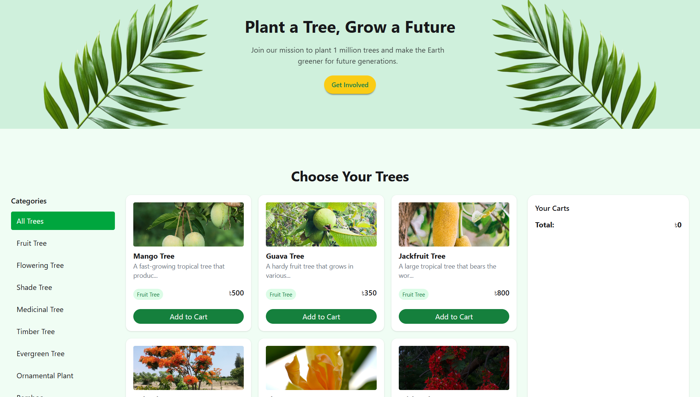

# 🌿 Green Earth

A responsive, eco-themed tree planting website built with **HTML**, **Tailwind CSS**, and **Vanilla JavaScript** — helping users browse and "plant" trees to support a mission of 1 million trees for a greener future.

---

## 🔗 Live Demo

👉 [https://green-earth.netlify.app](https://green-earth.netlify.app)

## 📂 GitHub Repository

🐙 [tauhid4678/Green-Earth](https://github.com/tauhid4678/Green-Earth)

---

## 📁 Project Structure

```
ASSIGNMENT-06/
├── assets/             # Images, icons, and other static assets
├── index.html          # Main HTML file
├── script.js           # JavaScript for interactivity & cart logic
├── tailwind.config.js  # Tailwind CSS configuration
└── README.md           # Project documentation
```

---

## 🛠️ Technologies Used

| Technology    | Purpose                           |
|---------------|-----------------------------------|
| HTML5         | Page structure & semantic markup  |
| Tailwind CSS  | Utility-first responsive styling  |
| JavaScript    | Cart interactivity & filtering    |

---

## ✨ Features

- 🌱 **Hero Section** — "Plant a Tree, Grow a Future" banner with a Get Involved CTA button
- 🛒 **Add to Cart** — Users can add trees to a live cart with real-time total price tracking
- 🗂️ **Category Filter** — Browse by All Trees, Fruit Tree, Flowering Tree, Shade Tree, Medicinal Tree, Timber Tree, Evergreen Tree, Ornamental Plant, Bamboo & more
- 🌳 **Tree Listings** — Cards with image, name, short description, category badge, and price (in ৳)
- 📱 **Fully Responsive** — Works seamlessly on mobile, tablet, and desktop
- 🎨 **Nature-Inspired Design** — Clean green palette with elegant card layout

---

## 🌳 Tree Categories

- 🥭 Fruit Tree (Mango, Guava, Jackfruit...)
- 🌸 Flowering Tree
- 🌲 Shade Tree
- 🌿 Medicinal Tree
- 🪵 Timber Tree
- 🌳 Evergreen Tree
- 🪴 Ornamental Plant
- 🎋 Bamboo

---

## 📸 Preview



---

## 🚀 Getting Started

### Run Locally

1. **Clone the repository:**
   ```bash
   git clone https://github.com/tauhid4678/Green-Earth.git
   cd Green-Earth
   ```

2. **Open in browser:**
   Simply open `index.html` in any modern browser, or use the **Live Server** extension in VS Code.

---

## 🌍 About the Project

**Green Earth** is a front-end web project designed to promote environmental awareness and tree plantation. Users can explore different tree categories, learn about each tree, and add them to their cart — supporting the mission to **plant 1 million trees** and make the Earth greener for future generations.

---

## 👤 Author

**Tauhid**
- GitHub: [@tauhid4678](https://github.com/tauhid4678)

---

## 📄 License

This project is open source and available under the [MIT License](LICENSE).

---

> *"The best time to plant a tree was 20 years ago. The second best time is now."* 🌎
